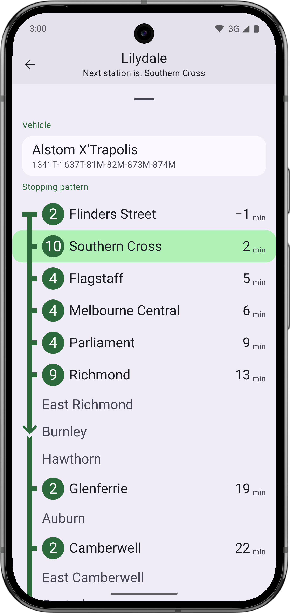
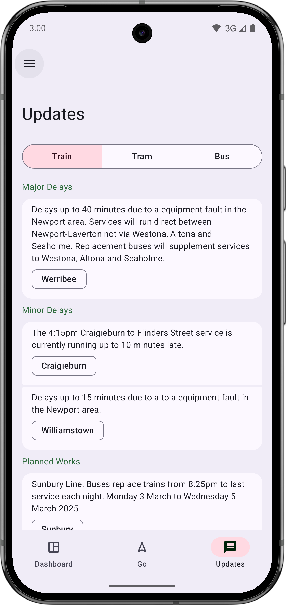

# metlook-eta

metlook (version eta) is a native Android public transport app for Melbourne, Australia.

It is my personal project that started out to create a better-looking alternative to the official PTV app.

The app is written in **Kotlin** using **Jetpack Compose** and [_Compose Material 3_](https://developer.android.com/jetpack/androidx/releases/compose-material3) components.

There is no fancy back-end, just this app front-end (I didn't know much about back-end when I started this).

---

## Features

- Google _Material Design 3_-compliant UI, with support for _Material You_
- Data from the official [PTV API](https://www.ptv.vic.gov.au/footer/data-and-reporting/datasets/ptv-timetable-api/) (same as the official app, for better or worse)
- _Grouped_ departures page
  - Easily see services for related lines together (e.g. Pakenham and Cranbourne, Belgrave and Lilydale)
  - Clearly know when the next and following services are expected
- 'Live view' to track a specific service
  - Metro-style stopping pattern, with skipped-stop indicators
  - Service transposal information, including preceding and continuing services, for trains only
  - Vehicle information (for trains and trams only)
- Times with asterisks (\*) indicate a _scheduled_ time, instead of a live _estimated_ time
- 'Now\*' indicates an _arriving_ service (approaching stop/station), while 'Now' indicates a service arrived at the stop/station
- Remembering recently viewed stops/stations and services, with the ability to 'pin' favourites
- At-a-glance page for service disruptions

## What's not there (yet)

- Live map view on the service-tracking screen (the Maps API is quite complex)
- Find nearby stops based on location
- Line interchange information

## Usage

- Clone repo, and run Gradle sync to install dependencies.
- Add a Developer ID and API Key in `common/utils/PtvApi.kt` under values `DEV_ID` and `API_KEY`.

(Note: Changes to the PTV API in the future may unexpectedly break some functionality.)

> _Why did you use activities for different pages/screens instead of Compose `NavController`?_
>
> I wanted Predictive Back Gesture animations that didn't look bad, and passing data is much easier when it can be serialised (e.g. in Bundles using activities).

## Screenshots

|                                                              |                                                                           |                                                              |
| ------------------------------------------------------------ | ------------------------------------------------------------------------- | ------------------------------------------------------------ |
|         |                    |        |
|  |  |  |

_More screenshots in `docs/img`._
